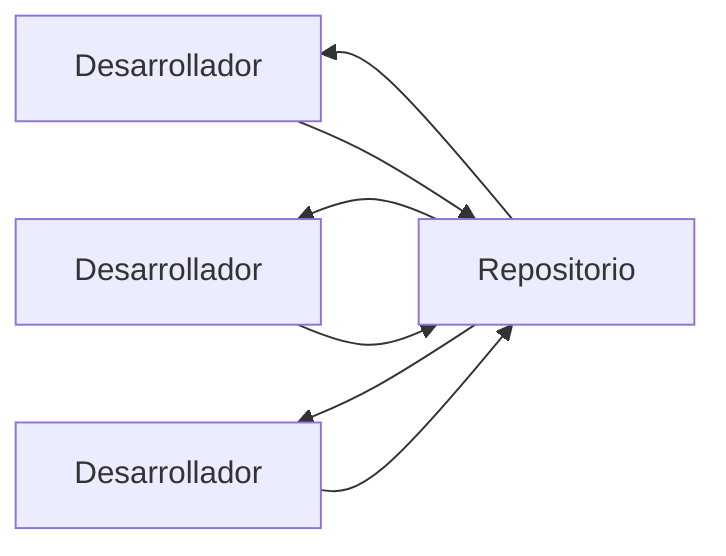
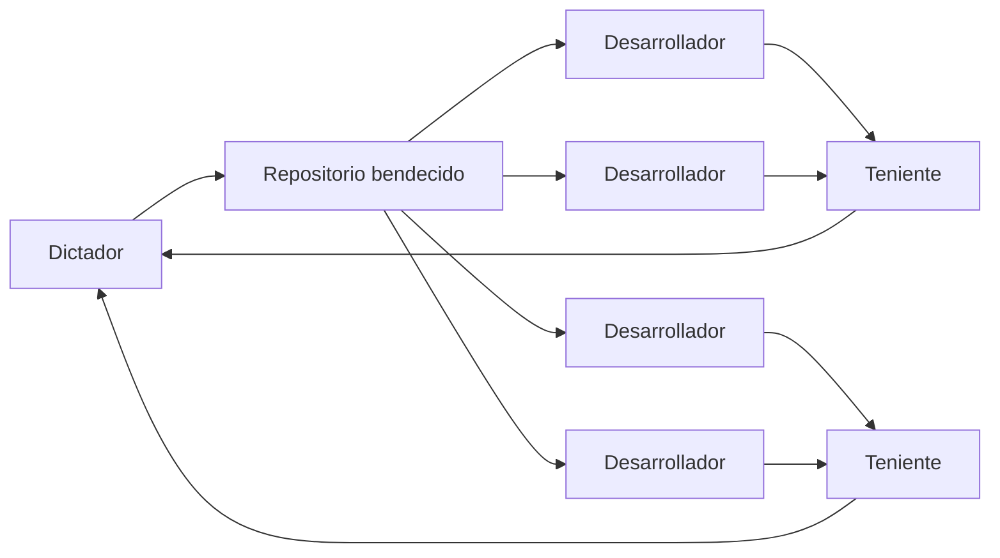
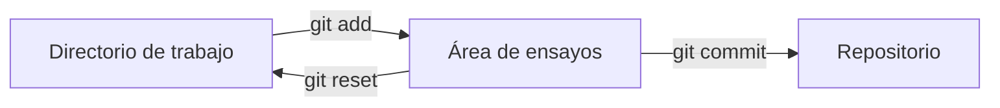
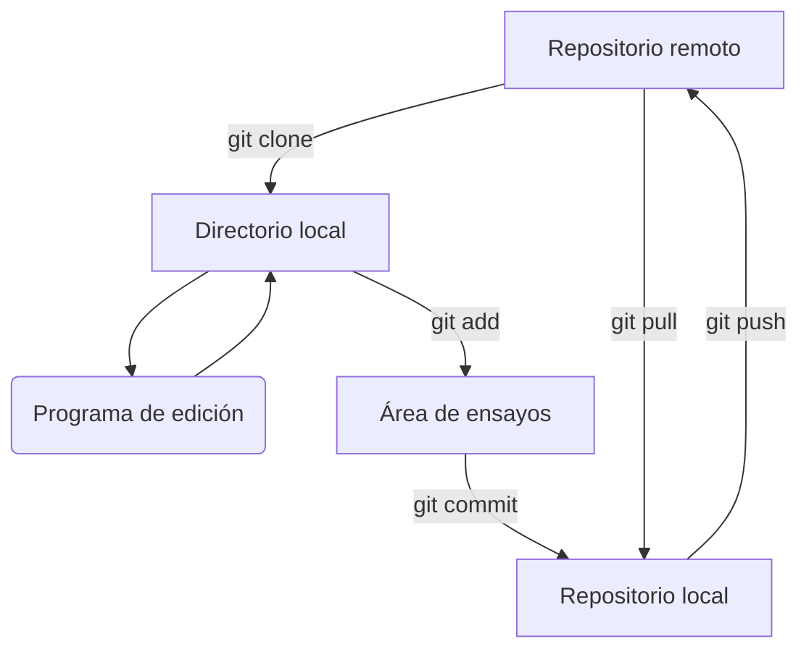

### Universidad de Costa Rica
#### IE0405 - Modelos Probabilísticos de Señales y Sistemas
---
# `Git0` - *Introducción a git*

>Git es un sistema de control de versiones (**VCS**, *version control system*) para monitorear cambios en archivos de código fuente. 
---
---
Git permite:

* Hacer control distribuido (no centralizado) de versiones.
* Coordinar el trabajo entre múltiples desarrolladores.
* Especificar cuáles cambios fueron hechos y quiénes y cuándo los hicieron.
* Retornar a versiones anteriores del código.
* Utilizar "repositorios" locales y remotos.

## Características

En la página oficial de [git]([https://git-scm.com/about/](https://git-scm.com/about/free-and-open-source)) se encuentra una descripción de sus principales características:

### Ramificación y fusión (o unión: *branching and merging*)

Git está basado en un modelo de "ramificación", en el cual se pueden hacer *branches* (ramas) completamente independientes y con distintos propósitos, por ejemplo: 

* Una rama principal con el código "en producción"
* Una rama de prueba de prototipos o ideas
* Una rama de ensayo de nuevas características

Todas estas ramificaciones pueden luego fusionarse con la principal o desecharse. Se pueden hacer tantas ramificaciones como se desee (y ramificaciones de ramificaciones) y se puede fusionar luego una, algunas o todas ellas.

### Área de ensayos

Un área intermedia en la que se monitorean los cambios, se prueba su utilidad, se aprueba y luego se envía al repositorio.

### Sistema distribuido

Cada usuario tiene un respaldo completo (o "clon") del servidor principal (ya sea local o remoto). Esto permite restablecer el trabajo en caso de fallos en el servidor principal.

#### Modelos de flujo de trabajo

Por el sistema de ramificaciones descrito, la forma en que fluye el código y se aprueba su reincorporación a la rama principal varía según la circunstancia, pero las opciones de configuración son casi ilimitadas. Dos ejemplos:

##### Modelo colaborativo

Todos los desarrolladores aportan al repositorio libremente, mientras tienen conocimiento de los cambios que aplican otros.

##### Modelo del "dictador"

Una sola persona (o grupo pequeño) autoriza los cambios que ingresan al repositorio "bendecido".

### Seguridad de los datos

Todos los bits que se gestionan en git tienen "seguridad criptográfica", es decir, serán exactamente los que se escribieron.

### Más información

* El libro [Pro Git]([https://git-scm.com/book/es/v2](https://git-scm.com/book/es/v2)) (disponible en español) es una revisión exhaustiva de todas las características de git.
* "Git y Github | Curso Práctico de Git y Github Desde Cero" por Fazt [YouTube](https://youtu.be/HiXLkL42tMU)
* "Git Tutorial for Beginners: Command-Line Fundamentals" por Corey Schafer [YouTube](https://youtu.be/HVsySz-h9r4)

## Y antes de seguir: ¿cómo instalar git?

Desde la página de [git-scm]([https://git-scm.com/download/](https://git-scm.com/download/)) se debe utilizar el método de instalación indicado para cada sistema operativo. Desde la terminal puede ser, por ejemplo:

* (Debian/Ubuntu) `# apt-get install git`
* (macOS) `$ brew install git`
* (Windows) *Descarga e instalación manual*

Una vez instalado, en la misma terminal se puede probar que funciona correctamente ejecutando algunas de las siguientes instrucciones:

* `$ git` muestra una descripción de las opciones que tiene
* `$ git --version` muestra la versión (ejemplo: 2.24.2)
* `$ git help tutorial` abre el editor `less` (u otro) donde se muestra un paso a paso de "cómo importar un nuevo proyecto en git, hacerle cambios y compartir los cambios con otros/as desarrolladores/as".
* 
## Principales conceptos de git

Git tiene "lugares" donde se mueven los archivos.

### *Working directory*[^1] (directorio de trabajo)

> Cambios no monitoreados

Es el directorio local donde el usuario tiene almacenados los archivos ligados al proyecto.

### *Staging area*[^2] o *index* (área de ensayos)

> Cambios monitoreados pero no enviados al repositorio

Es donde el usuario va a agregar los archivos que va modificando para luego guardarlos en el repositorio.

### *Repository*[^3] (repositorio)

> Algo aquí

Es el lugar donde se encuentran los archivos con los cambios realizados por todos los desarrolladores participantes en las diferentes ramas. Puede ser local o remoto (ver sección Servidores remotos de git).

##  Primero lo primero
Deberíamos "presentarnos" con git, es decir, indicar quién hace los cambios en un proyecto.

* `$ git config --global user.name "Nombre"`
* `$ git config --global user.email you@yourdomain.example.com`

Se pueden revisar los datos guardados con `$ git config user.name` y `$ git config user.email` y, en general, todos esos datos se revisan con `$ git config --list`. 

### Segundo lo segundo

Git tiene "verbos" o instrucciones o acciones (como se verá más adelante: *init*, *add*, *push*, *pull*…). Para obtener ayuda sobre ellos directamente desde git, se utilizan las instrucciones:

* `$ git help <verbo>`
* `$ git <verbo> --help`

### Tercero lo tercero

Estos comandos esenciales se ejecutan desde la terminal (ver Ejemplo 1) y se aplican sobre el directorio actual.

> Recordatorio: en una terminal en ambiente Unix son básicas las instrucciones `pwd` (**p** *rint* **w** *orking* **d** *irectory*) para mostrar el directorio actual, `ls` (**l** *i* **s** *t*) para mostrar los elementos en el directorio actual, `cd` (**c** *hange* **d** *irectory*) para cambiar de directorio, y `rm` (**r** *e* **m** *ove*) para eliminar un archivo o directorio.

| Comando | Descripción |
|--|--|
| `git init` | Iniciar un proyecto nuevo usando git, que se traslada al *working directory* (directorio de trabajo). |
| `git add` | Pasar los archivos del *working directory* al *staging area* (área de ensayos). |
| `git status` | Consultar en qué estado se encuentran los archivos. Pueden estar en el *área de ensayos* (donde se monitorean sus cambios) o solamente en el *directorio de trabajo* (donde **no** se monitorean sus cambios). |
| `git commit` | Guardar una primera versión del código. |
| `git push` | Subir los cambios que realiza el usuario a un repositorio remoto. |
| `git pull` | En el caso que el usuario esté trabajando con otros desarrolladores, con este comando descarga los cambios realizados por los otro desarrolladores. |
| `git clone` | Hacer una copia desde el servidor central (local o remoto) donde está el código hasta la computadora del usuario para que trabaje en él. |

## *Ejemplo 1*: en un repositorio local

### Inicializar el seguimiento de un nuevo directorio

1. Para este ejemplo, crear una carpeta (folder, directorio) en cualquier parte, por ejemplo en el escritorio. Aquí es donde se van a almacenar localmente los archivos.
2. Crear un archivo cualquiera. Por ejemplo, el archivo `himno.txt` disponible.
3. En la terminal, ubicarse en el directorio de trabajo con la instrucción de terminal `$ cd <path>`.
4. Inicializar git dentro de esta carpeta con `$ git init`. Esto va a crear una carpeta oculta en este directorio donde git almacenará la información relevante para su funcionamiento.
5. Puede corroborarse ahora el estatus en esta carpeta con `$ git status`.  Aquí posiblemente salga un mensaje como *"On branch master"* y *"No commits yet"* junto con una lista de *"Untracked files"*, es decir, archivos que están en la carpeta pero que no han sido incluidos en lo que va a ser monitoreado por git (el *área de ensayos*).

### Agregar archivos al área de ensayos

6. Para agregar al *área de ensayos* uno de los archivos presentes, es necesaria la ejecución de `$ git add <archivo>` (incluyendo la extensión). Nota: para agregar *todos* los archivos se puede usar `$ git add .` (con el punto).
7. Luego de agregar un archivo con la instrucción anterior, se verifica de nuevo con `$ git status`. Si fue exitosa la adición, aparecerá ahora *"Changes to be commited"* y *"new file: `<archivo>`"*. En general, con `$ git status` habrá una lista de archivos en la carpeta de trabajo que están monitoreados por git y los otros que no.
8. Ahora se pueden hacer algunos cambios en `<archivo>` en cualquier editor y guardar esos cambios.
9. Al verificar nuevamente con `$ git status` aparece como *"modified"*.

### Enviar cambios al repositorio

10. Ejecutar `$ git commit`
11. Ahora aparecerá un editor de texto dentro de la misma terminal, o bien VIM, o vi, o gedit. Aquí es obligatorio introducir un texto que acompaña el primer `commit`. Debe ser un texto suficientemente descriptivo. Y un **peligro** aquí: ¿cómo salir del editor? La respuesta es indeseablemente críptica: `Esc` + `:` + `w` (*write*) + `q` (*quit*).
12. Alternativa: con `$ git commit -m 'El mensaje de commit.'` no se necesita ningún editor, sino que ya va incluido el mensaje obligatorio.
13. Con `$ git log` se mostrará el "hash" (identificador único) del *commit* y el autor y fecha.
14. Al modificar de nuevo `himno.txt` y guardar los cambios, `$ git status` va a mostrar *"Changes not staged for commit: modified: himno.txt"*. Falta entonces llevar el archivo de nuevo al área de ensayos con `$ git add himno.txt`
15. Si ahora nuevamente guardamos los cambios en el repositorio con `$ git commit -m 'Nuevo mensaje'`, veremos algo como *"1 file changed, 2 insertions(+), 2 deletions(-)"*

#### Resumen de comandos nuevos utilizados

| Comando | Descripción |
|--|--|
| `git add .` o `git add -A` | Agregar *todos* los archivos al *staging area* |
| `git commit -m 'Mensaje.'` | Agregar comentario directamente para guardar los cambios en el repositorio |
| `git commit -a` | Identificar archivos modificados (pero no nuevos), agregarlos al *index* y guardar en el repositorio |

## Servidores remotos de git

### GitHub

En este curso los archivos estarán almacenados en un repositorio de GitHub, que es un popular servicio de alojamiento de repositorios.

### Otros sistemas git

Además de GitHub, existen también:

* GitLab
* BitBucket
* Launchpad
* Deveo
* RhodeCode
* Gitea

La Escuela de Ingeniería Eléctrica tiene un servidor de git con Gitea, disponible en [https://git.eie.ucr.ac.cr/](https://git.eie.ucr.ac.cr/).

## *Ejemplo 2*: desde un repositorio remoto

### Clonar un repositorio remoto

* `$ git clone <url> <lugar para clonar>`
* `$ git clone ../Para-Clonar/ .`
* `$ git clone `

**Nota**: `<url>` puede en realidad ser otro directorio dentro de la computadora. El punto `.` quiere decir "en el directorio actual".

### Flujo usual de trabajo con "master branch"

1. En la computadora personal, en la carpeta del curso, se puede crear una nueva carpeta llamada `mpss` donde clonar los "cuadernos" de Jupyter del curso y otros materiales del curso.
2. Se puede hacer un "clon" del tutorial `Py0` - *Introducción a Python* para ejecutar localmente. El archivo `Py0.ipynb` está alojado en GitHub en la dirección 

[^1]: *"Working directory"*: | ˈwərkiNG diˈrektərē |
[^2]: *"Staging area"*: | ˈstājiNG ˈerēə |
[^3]: *"Repository"*: | rəˈpäzəˌtôrē |
